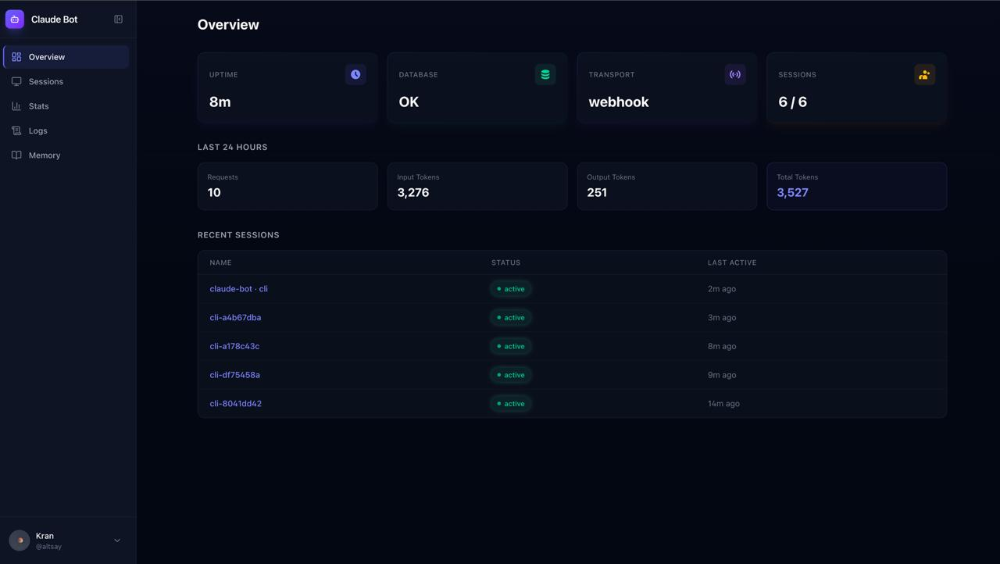
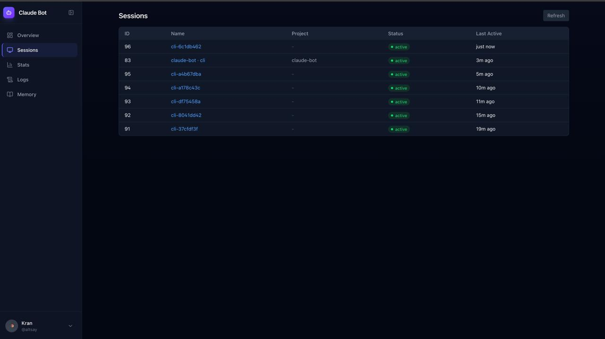
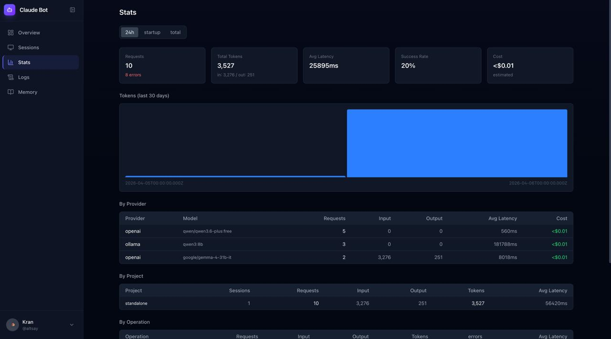
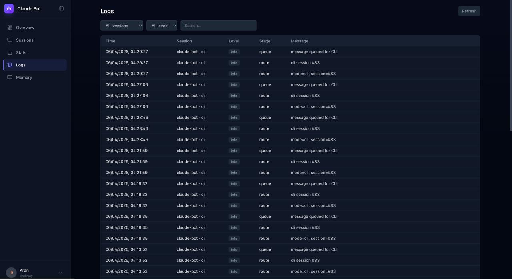

# Dashboard

Web dashboard for monitoring and managing your Helyx instance. Access it at `http://localhost:3847` (or your configured domain).

Authentication via Telegram Login Widget — only users listed in `ALLOWED_USERS` can access.

## Overview

System health at a glance: uptime, database status, transport mode, active sessions, and 24-hour token usage summary.

## Sessions

All connected CLI sessions with status, project path, and last activity time. Click a session to view its messages, rename, or delete it.

## Stats

Detailed API usage statistics with time window filters (24h / since startup / all-time):

- **Summary cards** — total requests, tokens (input/output), average latency, success rate, estimated cost
- **Token chart** — 30-day daily token usage bar chart
- **By Provider** — breakdown by API provider and model with cost estimation
- **By Project** — aggregated stats per project directory
- **By Operation** — chat vs summarize vs generate breakdown with error counts
- **By Session** — per-session token usage and latency
- **Error drill-down** — click error count to open a slide panel with full error details

## Logs

Structured request logs with filtering by session, level (info/warn/error), and full-text search. Click any row to open a slide panel with the complete log message.

## Memory

Browse and manage long-term memories — summaries, facts, and user-saved entries. Filter by type, project, or search by content. Delete individual memories.
